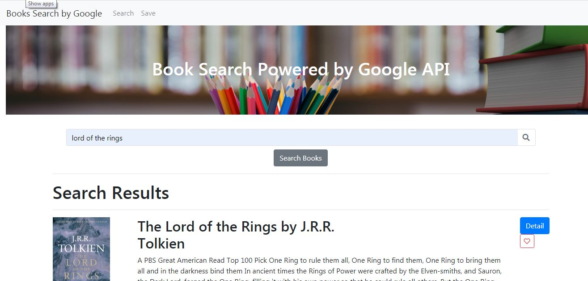

# Google Books Search

## Overview

* This app will use the Google Books API to search for books and display the results
* The app has 2 pages, one is used to search the books and other will save the favorite selection
* Using the Mongo DB the selection will be saved with the detail of title, author, description, image an the URL

## Technologies used to develop the app

- React.js
- Express.js
- Mongoose
- Axios
- Mongo DB
- JSON

## App Link
https://jfsh-googlebookssearch.herokuapp.com

## Author
ISC Francisco Silva
